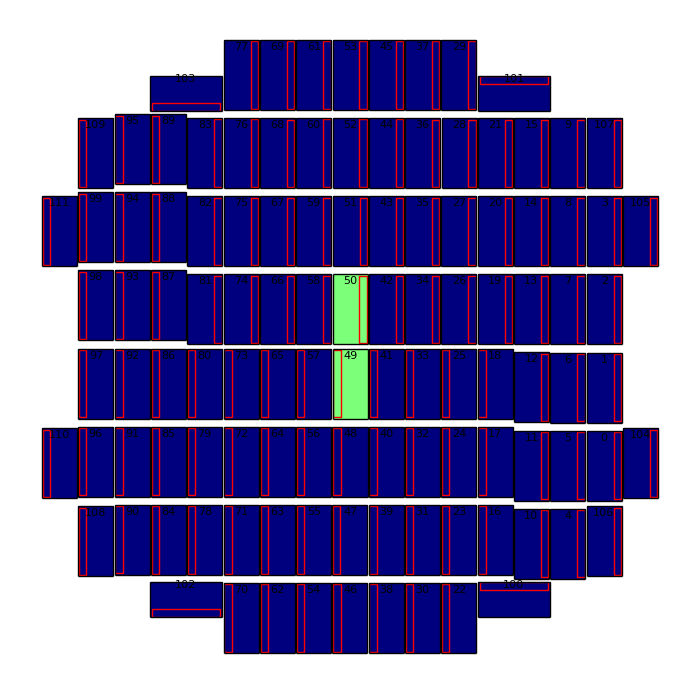
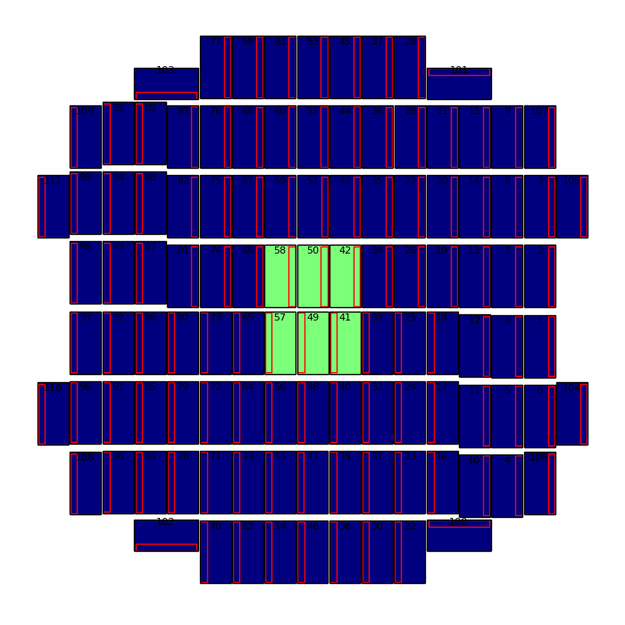
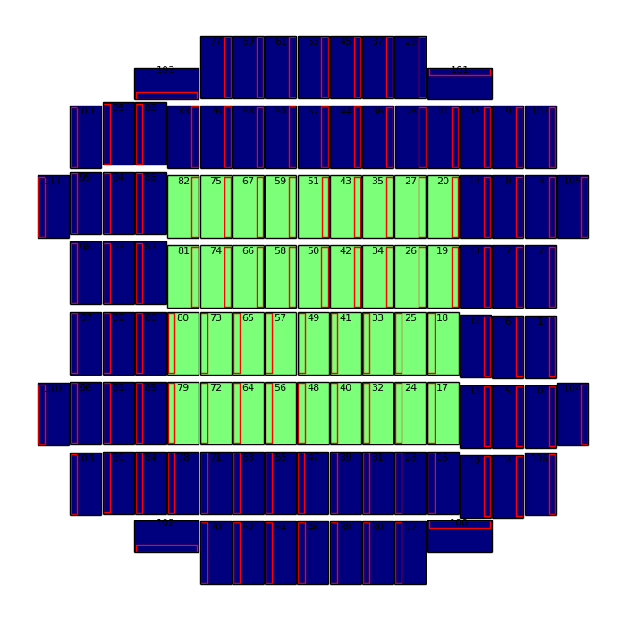
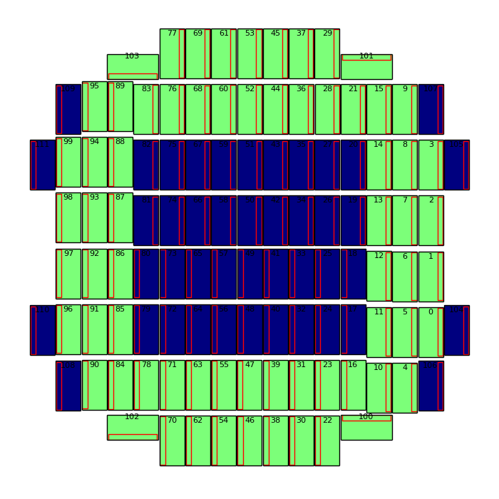
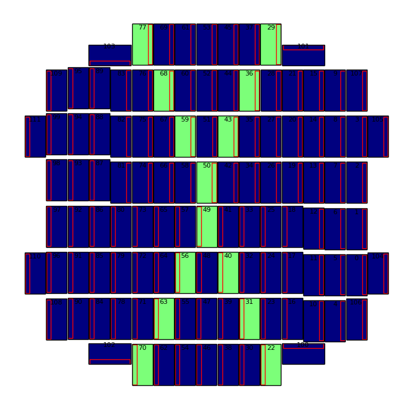

========
HSC CCDs
========

.. _hscccds:

It's often useful to run a subset of CCDs quickly.  You can specify
e.g. CCDs 49 and 50 with ``--id ccd=49^50``, but other parts of the
camera may be of interest. Below are various patterns which may be
useful if for example you only want the edge CCDs, or a mixture of
edge and central CCDs, etc.  Each is specified as a carat
``^``-separated list so that it can be copy/pasted and used as input
for an ``--id`` statement, and also as a list of aliases which can be
entered in a ``.bashrc`` for more convenient use.

.. contents::
   :local:
   :depth: 2

CCD patterns for testing and development
----------------------------------------

Center Two
^^^^^^^^^^

* (no alias provided ... just remember these)::

   49^50



Center Six
^^^^^^^^^^
   
::
   
   58^50^42^57^49^41




   
The Central Core (and Complement)
^^^^^^^^^^^^^^^^^^^^^^^^^^^^^^^^^

::

   18^19^25^26^33^34^41^42^49^50^57^58^65^66^73^74^80^81
   
.. image:: images/hscCore.png
   :width: 30%

::

   0^1^2^3^4^5^6^7^8^9^10^11^12^13^14^15^16^17^20^21^22^23^24^27^28^29^30^31^32^35^36^37^38^39^40^43^44^45^46^47^48^51^52^53^54^55^56^59^60^61^62^63^64^67^68^69^70^71^72^75^76^77^78^79^82^83^84^85^86^87^88^89^90^91^92^93^94^95^96^97^98^99^100^101^102^103

.. image:: images/hscNotCore.png
   :width: 30%

   
Large Central Core (and Complement)
^^^^^^^^^^^^^^^^^^^^^^^^^^^^^^^^^^^

::

   18^19^25^26^33^34^41^42^49^50^57^58^65^66^73^74^80^81^82^75^67^59^51^43^35^27^20^79^72^64^56^48^40^32^24^17   



::
   
    0^1^2^3^4^5^6^7^8^9^10^11^12^13^14^15^16^21^22^23^28^29^30^31^36^37^38^39^44^45^46^47^52^53^54^55^60^61^62^63^68^69^70^71^76^77^78^83^84^85^86^87^88^89^90^91^92^93^94^95^96^97^98^99^100^101^102^103



   

   
Edge CCDs
^^^^^^^^^

::

   0^1^2^3^9^101^29^37^45^53^61^69^77^103^95^99^98^97^96^90^102^70^62^54^46^38^30^22^100^4
   
.. image:: images/hscEdge.png
   :width: 30%

All CCDs except the edge
^^^^^^^^^^^^^^^^^^^^^^^^

::

   5^6^7^8^10^11^12^13^14^15^16^17^18^19^20^21^23^24^25^26^27^28^31^32^33^34^35^36^39^40^41^42^43^44^47^48^49^50^51^52^55^56^57^58^59^60^63^64^65^66^67^68^71^72^73^74^75^76^78^79^80^81^82^83^84^85^86^87^88^89^91^92^93^94
   
.. image:: images/hscNoEdge.png
   :width: 30%

Central column and row
^^^^^^^^^^^^^^^^^^^^^^

::

   46^47^48^49^50^51^52^53^98^93^87^81^74^66^58^50^42^34^26^19^13^7^2
   
.. image:: images/hscPlus.png
   :width: 30%


Diagonals
^^^^^^^^^

::

   70^63^56^49^50^43^36^29^77^68^59^40^31^22   
   


Wide diagonals
^^^^^^^^^^^^^^

::

   95^89^83^75^67^58^50^42^35^27^21^15^9^90^84^78^72^64^57^49^41^32^24^16^10^4
  
.. image:: images/hscColX.png
   :width: 30%


Sparse diagonal
^^^^^^^^^^^^^^^

::

   49^50^75^95^27^9^72^90^24^4

.. image:: images/hscStar.png
   :width: 30%


All CCDs except the central six
^^^^^^^^^^^^^^^^^^^^^^^^^^^^^^^

::
   
   0^1^2^3^4^5^6^7^8^9^10^11^12^13^14^15^16^17^18^19^20^21^22^23^24^25^26^27^28^29^30^31^32^33^34^35^36^37^38^39^40^43^44^45^46^47^48^51^52^53^54^55^56^59^60^61^62^63^64^65^66^67^68^69^70^71^72^73^74^75^76^77^78^79^80^81^82^83^84^85^86^87^88^89^90^91^92^93^94^95^96^97^98^99^100^101^102^103
   
.. image:: images/hscNotSix.png
   :width: 30%

   

List of Aliases
---------------

Below is a listing of aliases suitable for a ``.bashrc`` file.  You can then use a specified pattern by name (obviously you should feel free to rename as you see fit).  Using ``hscSixCcds``, here some examples:

* print the list::

    $ hscSixCcds
    58^50^42^57^49^41

* run ``hscProcessCcd.py`` with only the central six CCDs.  In bash, you can use either the backticks operator ```hscSixCcds```, or command substitution ``$(hscSixCcds)``::

    # with command subsitution
    $ hscProcessCcd.py /path/to/data --id visit=1234 ccd=$(hscSixCcds)

    # with backticks
    $ hscProcessCcd.py /path/to/data --id visit=1234 ccd=`hscSixCcds`
    

The following listing can be copy/pasted to ``.bashrc`` to make aliases for each pattern available::


    alias hscSixCcds='echo 58^50^42^57^49^41'
    alias hscCoreCcds='echo 18^19^25^26^33^34^41^42^49^50^57^58^65^66^73^74^80^81'
    alias hscNotCoreCcds='echo 0^1^2^3^4^5^6^7^8^9^10^11^12^13^14^15^16^17^20^21^22^23^24^27^28^29^30^31^32^35^36^37^38^39^40^43^44^45^46^47^48^51^52^53^54^55^56^59^60^61^62^63^64^67^68^69^70^71^72^75^76^77^78^79^82^83^84^85^86^87^88^89^90^91^92^93^94^95^96^97^98^99^100^101^102^103'
    alias hscCore2Ccds='echo 18^19^25^26^33^34^41^42^49^50^57^58^65^66^73^74^80^81^82^75^67^59^51^43^35^27^20^79^72^64^56^48^40^32^24^17'
    alias hscNotCore2Ccds='echo 0^1^2^3^4^5^6^7^8^9^10^11^12^13^14^15^16^21^22^23^28^29^30^31^36^37^38^39^44^45^46^47^52^53^54^55^60^61^62^63^68^69^70^71^76^77^78^83^84^85^86^87^88^89^90^91^92^93^94^95^96^97^98^99^100^101^102^103'    

    alias hscEdgeCcds='echo 0^1^2^3^9^101^29^37^45^53^61^69^77^103^95^99^98^97^96^90^102^70^62^54^46^38^30^22^100^4'
    alias hscNoEdgeCcds='echo 5^6^7^8^10^11^12^13^14^15^16^17^18^19^20^21^23^24^25^26^27^28^31^32^33^34^35^36^39^40^41^42^43^44^47^48^49^50^51^52^55^56^57^58^59^60^63^64^65^66^67^68^71^72^73^74^75^76^78^79^80^81^82^83^84^85^86^87^88^89^91^92^93^94'
    alias hscPlusCcds='echo 46^47^48^49^50^51^52^53^98^93^87^81^74^66^58^50^42^34^26^19^13^7^2'
    alias hscXCcds='echo 70^63^56^49^50^43^36^29^77^68^59^40^31^22'
    alias hscColXCcds='echo 95^89^83^75^67^58^50^42^35^27^21^15^9^90^84^78^72^64^57^49^41^32^24^16^10^4'
    alias hscStarCcds='echo 49^50^75^95^27^9^72^90^24^4'
    # an alternative, more abbreviated version for the complement to central six.
    # alias hscNotSixCcds='echo 0..40^43..48^51..56^59..103'
    alias hscNotSixCcds='echo 0^1^2^3^4^5^6^7^8^9^10^11^12^13^14^15^16^17^18^19^20^21^22^23^24^25^26^27^28^29^30^31^32^33^34^35^36^37^38^39^40^43^44^45^46^47^48^51^52^53^54^55^56^59^60^61^62^63^64^65^66^67^68^69^70^71^72^73^74^75^76^77^78^79^80^81^82^83^84^85^86^87^88^89^90^91^92^93^94^95^96^97^98^99^100^101^102^103'

