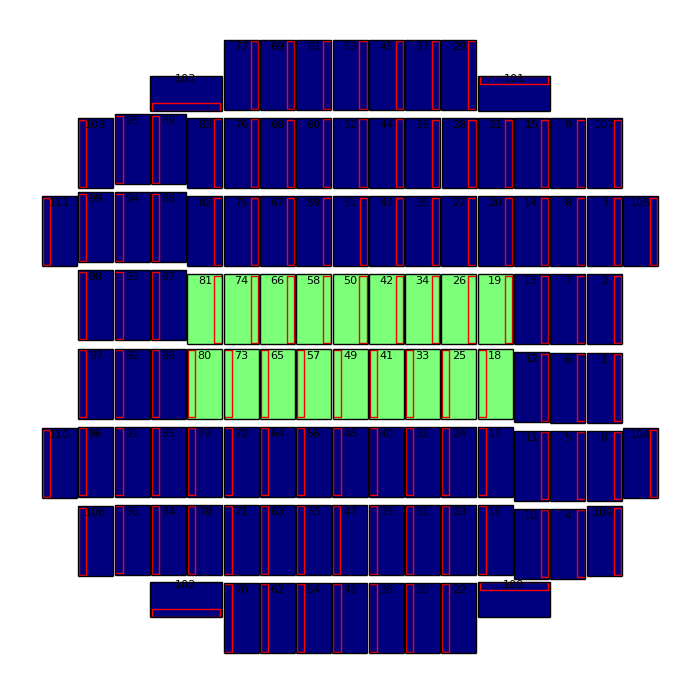
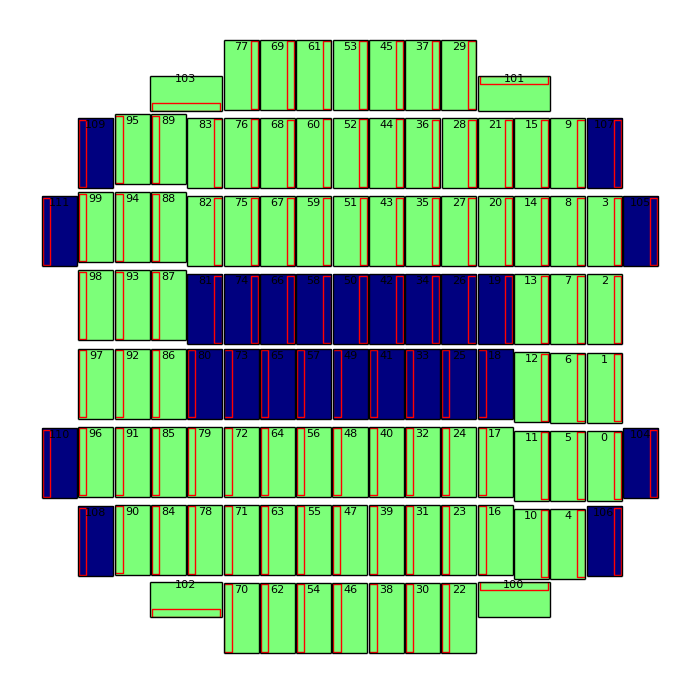
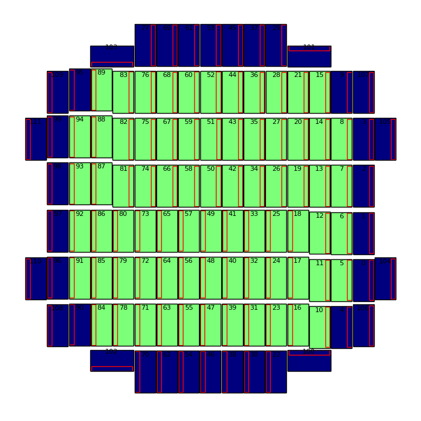
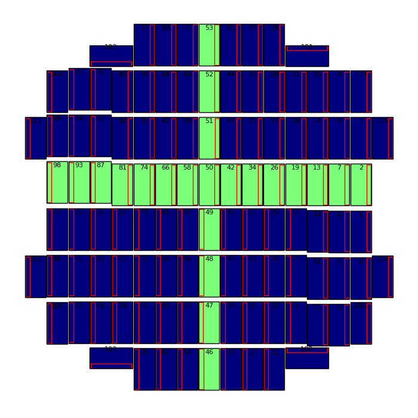
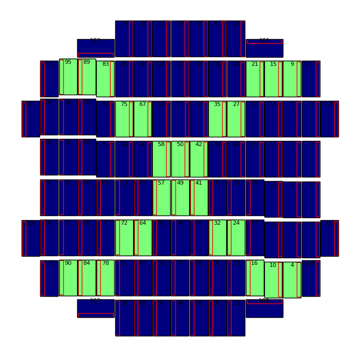
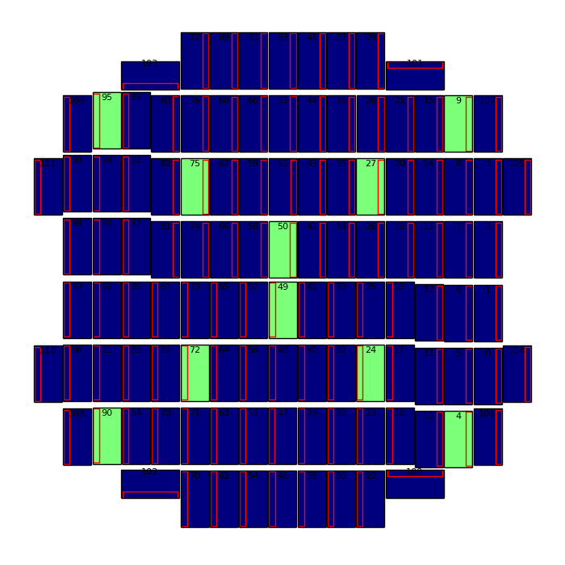
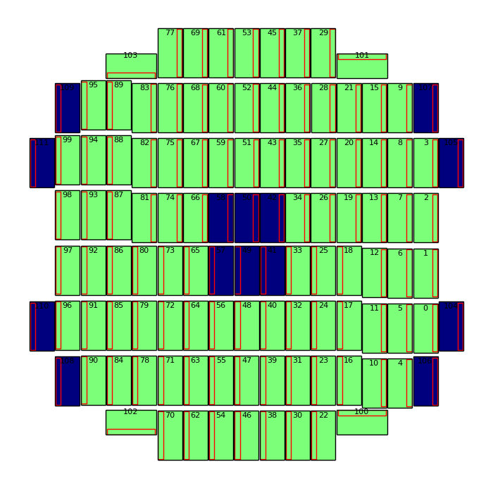

================
HSC の CCDs
================

.. _jp_hscccds:

CCD の一部を使って解析を実行する方法を紹介します。例えば、CCD ID 49, 50 の 2 つの
CCD を指定して解析した場合は ``--id ccd=49^50`` と書くことができます。以下では CCD
を指定する様々なバリエーション（例えば、端の CCD を使う場合、端と中心の CCD を使う場合等）
を紹介します。個別の CCD を指定したい時は ``--id`` のパラメータに ``ccd=`` と ``^`` 
合わせて使います。以下の例で使いたいものがあれば、コピー & ペイストして使ってください。
また、よく使う ``--id`` を alias にして ``.bashrc`` に記述するのも以降の解析では便利かもしれません。
その方法も最後に紹介します。

.. contents::
   :local:
   :depth: 2

開発・試験用 CCD パターン
----------------------------------------

中心 2 つ
^^^^^^^^^^

* （alias はありませんので、この組み合わせは覚えてください） ::

   49^50

.. image:: images/hscTwo.png
   :width: 30%

中心 6 つ
^^^^^^^^^^
   
::
   
   58^50^42^57^49^41

.. image:: images/hscSix.png
   :width: 30%


   
中心いくつか（逆に中心いくつか以外の場合）
^^^^^^^^^^^^^^^^^^^^^^^^^^^^^^^^^^^^^^^^^^^^

::

   18^19^25^26^33^34^41^42^49^50^57^58^65^66^73^74^80^81
   


::

   0^1^2^3^4^5^6^7^8^9^10^11^12^13^14^15^16^17^20^21^22^23^24^27^28^29^30^31^32^35^36^37^38^39^40^43^44^45^46^47^48^51^52^53^54^55^56^59^60^61^62^63^64^67^68^69^70^71^72^75^76^77^78^79^82^83^84^85^86^87^88^89^90^91^92^93^94^95^96^97^98^99^100^101^102^103



   
中心いくつか大きめ（逆に中心いくつか大きめ以外の場合）
^^^^^^^^^^^^^^^^^^^^^^^^^^^^^^^^^^^^^^^^^^^^^^^^^^^^^^^

::

   18^19^25^26^33^34^41^42^49^50^57^58^65^66^73^74^80^81^82^75^67^59^51^43^35^27^20^79^72^64^56^48^40^32^24^17   

.. image:: images/hscCore2.png
   :width: 30%

::
   
    0^1^2^3^4^5^6^7^8^9^10^11^12^13^14^15^16^21^22^23^28^29^30^31^36^37^38^39^44^45^46^47^52^53^54^55^60^61^62^63^68^69^70^71^76^77^78^83^84^85^86^87^88^89^90^91^92^93^94^95^96^97^98^99^100^101^102^103


.. image:: images/hscNotCore2.png
   :width: 30%
   

   
端の CCD のみ
^^^^^^^^^^^^^^^^^^^^^

::

   0^1^2^3^9^101^29^37^45^53^61^69^77^103^95^99^98^97^96^90^102^70^62^54^46^38^30^22^100^4
   
.. image:: images/hscEdge.png
   :width: 30%

端の CCD 以外の全 CCD
^^^^^^^^^^^^^^^^^^^^^^^^

::

   5^6^7^8^10^11^12^13^14^15^16^17^18^19^20^21^23^24^25^26^27^28^31^32^33^34^35^36^39^40^41^42^43^44^47^48^49^50^51^52^55^56^57^58^59^60^63^64^65^66^67^68^71^72^73^74^75^76^78^79^80^81^82^83^84^85^86^87^88^89^91^92^93^94
   


中心の CCD 行 & 列
^^^^^^^^^^^^^^^^^^^^^^

::

   46^47^48^49^50^51^52^53^98^93^87^81^74^66^58^50^42^34^26^19^13^7^2
   



対角線（斜め方向） CCD
^^^^^^^^^^^^^^^^^^^^^^^^^^^^^^^^^

::

   70^63^56^49^50^43^36^29^77^68^59^40^31^22   
   
.. image:: images/hscX.png
   :width: 30%

太め対角線（斜め方向） CCD
^^^^^^^^^^^^^^^^^^^^^^^^^^^^^^^^^

::

   95^89^83^75^67^58^50^42^35^27^21^15^9^90^84^78^72^64^57^49^41^32^24^16^10^4
  



細め対角線（斜め方向） CCD
^^^^^^^^^^^^^^^^^^^^^^^^^^^^^^^^^

::

   49^50^75^95^27^9^72^90^24^4




中心 6 つ以外の全 CCD
^^^^^^^^^^^^^^^^^^^^^^^^^^^^^^^

::
   
   0^1^2^3^4^5^6^7^8^9^10^11^12^13^14^15^16^17^18^19^20^21^22^23^24^25^26^27^28^29^30^31^32^33^34^35^36^37^38^39^40^43^44^45^46^47^48^51^52^53^54^55^56^59^60^61^62^63^64^65^66^67^68^69^70^71^72^73^74^75^76^77^78^79^80^81^82^83^84^85^86^87^88^89^90^91^92^93^94^95^96^97^98^99^100^101^102^103
   


   

alias 一覧
---------------
ここでは ``.bashrc`` に書くと便利だと思われるいくつかの alias を紹介します。例えば、
``hscSixCcds`` という alias を作ってみます（もちろん、
自身が使いやすい名称に変更していただいて構いません）。以下ににその例を示します。

.. highlight::
	bash

* alias list の中身（中心 6 つの CCD を指定） ::

    $ hscSixCcds
    58^50^42^57^49^41

* ``hscProcessCcd.py`` を上記の ailas に該当する CCD のみで実行する。bash では、```hscSixCcds``` か ``$(hscSixCcds)`` で変数を指定できます ::

    # $ マークを使った場合
    $ hscProcessCcd.py /path/to/data --id visit=1234 ccd=$(hscSixCcds)

    # ` ` マークを使った場合
    $ hscProcessCcd.py /path/to/data --id visit=1234 ccd=`hscSixCcds`
    
次に、上記の例を ``.bashrc`` にコピー & ペイストし、設定した alias を以下に載せます。 ::

    alias hscSixCcds='echo 58^50^42^57^49^41'
    alias hscCoreCcds='echo 18^19^25^26^33^34^41^42^49^50^57^58^65^66^73^74^80^81'
    alias hscNotCoreCcds='echo 0^1^2^3^4^5^6^7^8^9^10^11^12^13^14^15^16^17^20^21^22^23^24^27^28^29^30^31^32^35^36^37^38^39^40^43^44^45^46^47^48^51^52^53^54^55^56^59^60^61^62^63^64^67^68^69^70^71^72^75^76^77^78^79^82^83^84^85^86^87^88^89^90^91^92^93^94^95^96^97^98^99^100^101^102^103'
    alias hscCore2Ccds='echo 18^19^25^26^33^34^41^42^49^50^57^58^65^66^73^74^80^81^82^75^67^59^51^43^35^27^20^79^72^64^56^48^40^32^24^17'
    alias hscNotCore2Ccds='echo 0^1^2^3^4^5^6^7^8^9^10^11^12^13^14^15^16^21^22^23^28^29^30^31^36^37^38^39^44^45^46^47^52^53^54^55^60^61^62^63^68^69^70^71^76^77^78^83^84^85^86^87^88^89^90^91^92^93^94^95^96^97^98^99^100^101^102^103'    

    alias hscEdgeCcds='echo 0^1^2^3^9^101^29^37^45^53^61^69^77^103^95^99^98^97^96^90^102^70^62^54^46^38^30^22^100^4'
    alias hscNoEdgeCcds='echo 5^6^7^8^10^11^12^13^14^15^16^17^18^19^20^21^23^24^25^26^27^28^31^32^33^34^35^36^39^40^41^42^43^44^47^48^49^50^51^52^55^56^57^58^59^60^63^64^65^66^67^68^71^72^73^74^75^76^78^79^80^81^82^83^84^85^86^87^88^89^91^92^93^94'
    alias hscPlusCcds='echo 46^47^48^49^50^51^52^53^98^93^87^81^74^66^58^50^42^34^26^19^13^7^2'
    alias hscXCcds='echo 70^63^56^49^50^43^36^29^77^68^59^40^31^22'
    alias hscColXCcds='echo 95^89^83^75^67^58^50^42^35^27^21^15^9^90^84^78^72^64^57^49^41^32^24^16^10^4'
    alias hscStarCcds='echo 49^50^75^95^27^9^72^90^24^4'
    # an alternative, more abbreviated version for the complement to central six.
    # alias hscNotSixCcds='echo 0..40^43..48^51..56^59..103'
    alias hscNotSixCcds='echo 0^1^2^3^4^5^6^7^8^9^10^11^12^13^14^15^16^17^18^19^20^21^22^23^24^25^26^27^28^29^30^31^32^33^34^35^36^37^38^39^40^43^44^45^46^47^48^51^52^53^54^55^56^59^60^61^62^63^64^65^66^67^68^69^70^71^72^73^74^75^76^77^78^79^80^81^82^83^84^85^86^87^88^89^90^91^92^93^94^95^96^97^98^99^100^101^102^103'
