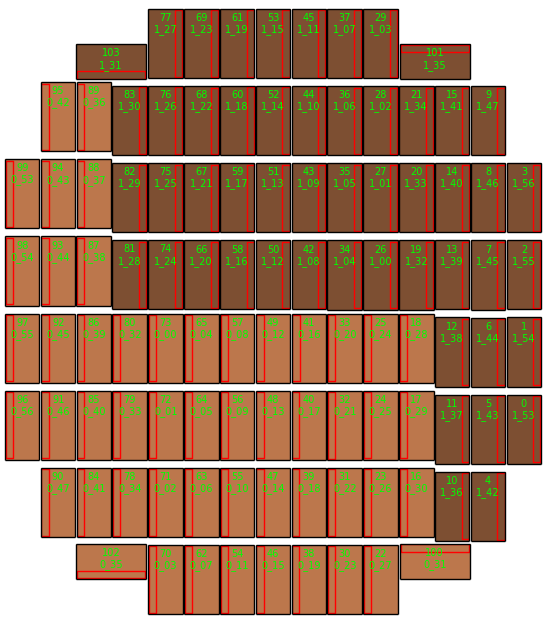

===========================
CCD のレイアウト
===========================

各 CCD の上に記述されている ID 番号は、CCD ID とカメラチーム用検出器名（'DETNAME'）です。
赤枠は各 CCD の読み出し回路の位置を表しています（ただし、読み出し回路は各 CCD に 4 つあり、
ここで表示しているのは 4 つのうちの 1 つです）。レイアウトの色の違いは HSC カメラの
2 つの異なるデバイスブロックを意味しています（読み出し回路 1 は、薄茶色系の CCD では左側に、
こげ茶色系 CCD では右側についています）。

.. _jp_hsc_layout:

