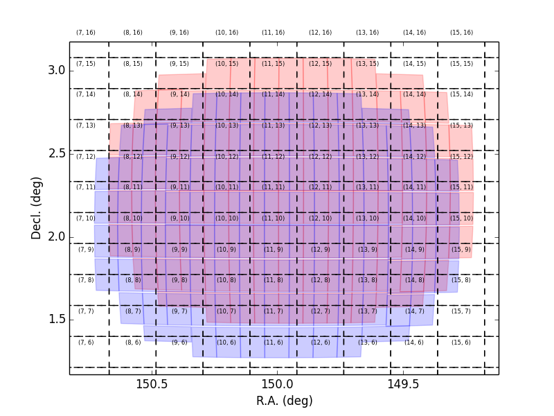

===========================
天体データの重ね合わせ
===========================

このページで紹介する解析は reduceFrames.py による各 CCD の一次処理と天体検出、測光が完了
していることを前提としています。もしまだ完了していない場合は、まず reduceFrames.py を実行してください。
天体データの重ね合わせの処理過程では、全ての天体データを共通の WCS 座標系に変換し、取得された
全ての天体データを重ね合わせて、S/N が改善された最終画像（coadd 画像）を生成します。以下のステップで天体データの
重ね合わせ処理は行われます。:

#. **SkyMap** （coadd 画像に用いられる座標系）を生成する。

#. **mosaic**: 等級原点や座標を決定する。

#. **Warp**: 観測された WCS 座標系から SkyMap の座標系に画像をリサンプルする（warp 画像の生成）。

#. **coadd 画像の生成**: warp 画像の足しあわせ。

#. **Process**: coadd 画像から天体を検出し、カタログを生成する。

以下では各解析ステップについて紹介します。なお、``warp``, ``assemble``, ``process``
は全て ``stack.py`` と呼ばれる 1 つの解析コマンド内で実行されています。

.. _jp_skymap:

SkyMap の生成
-----------------

まず最初に SkyMap を生成します。SkyMap は天球面上をタイル、またはモザイク状にしたもので、
最終 coadd 画像で用いられる座標系です。SkyMap で設定される最大の領域は 'Tract' と呼ばれ、
その中には複数の 'Patch' 領域が含まれています。Tract も Patch も隣の
Tract/Patch と重なり合うように設定されます。デフォルトでは、Tract は 1 arcmin、
Patch は 100 pix 重なるよう設定されています（1 Patch は 4000 x 4000 pix）。
各 Tract には異なる WCS が設定されていますが、その中にある Patch には Tract が持つ
WCS に対する offset の値が与えられます。以降の解析で紹介する warp において、
天体データが持つ観測時の WCS の情報は SkyMap による共通の WCS の情報に変換されます。

SkyMap を生成するには 2 つの方法があります: (1) 全天の情報を使って生成する
（個々の PI-type の観測データの解析では **使用しない** かもしれません）、または
(2) 観測データのみを使って生成する。

全天情報から SkyMap を生成する
^^^^^^^^^^^^^^^^^^^^^^^^^^^^^^^^^^^

全天情報から SkyMap を作成するためには、以下のコマンドを実行してください。 ::
   
    $ makeSkyMap.py /data/Subaru/HSC/ --rerun=cosmos

全天情報から生成された SkyMap を使用している場合、tract は固定座標をもとに決定されているので、
自分が使うデータがどの tract にあるか調べる必要があります。もし、ある visit, CCD
が入っている tract, patch を調べたい時には、``hscOverlaps.py`` コマンドを使って
次のように検索をかけることができます。 ::

    $ hscOverlaps.py /data/Subaru/HSC --rerun=cosmos --id visit=1226 ccd=49 --coadd deep

その他、tract を検索するコマンドは :ref:`findTract.py <jp_findtract>` にて紹介しています。

    
観測データをもとに SkyMap を生成する
^^^^^^^^^^^^^^^^^^^^^^^^^^^^^^^^^^^^^^^^

自分の観測データをもとに SkyMap を生成するには ``makeDiscreteSkyMap.py`` を使います。
このコマンドを使って tract を定義する場合、SkyMap に含めるべき visit を指定することができます。
以下の例では visit 1000 から　1020 まで 2 個飛ばしの visit 番号を指定しています。
もし``makeDiscreteSkyMap.py`` を使って SkyMap を生成すると、全ての観測領域が
tract ID 0 で定義される単一の tract 内に収まります。

::

    $ makeDiscreteSkyMap.py /data/Subaru/HSC/ --rerun=cosmos --id visit=1000..1020:2

参考までに、:ref:`showVisitSkyMap.py <jp_showvisitskymap>` では SkyMap 内の
visit を表示するスクリプトを載せています。以下の図は ``makeDiscreteSkyMap.py`` 
で生成された SkyMap に 2 つの visit （赤と青で塗られた領域）
を重ね合わせた絵をあらわしています。全 patch のうち、2 つの visit が重なっている
patch のみ抜き出しています。格子内に書かれた数字が patch 番号です。

ユーザー定義の SkyMap を生成する
^^^^^^^^^^^^^^^^^^^^^^^^^^^^^^^^^^

もし、ある特定の WCS 座標領域のみの coadd データが必要な時、自身で定義した
pixel サイズと領域をもつような SkyMap を生成することもできます。その場合は、
SkyMap のパラメータ情報が記入された config ファイルを用意し、
``makeSkyMap.py`` を以下のように実行します。 ::

    $ cat overrides.config
    root.skyMap = "discrete"
    root.skyMap["discrete"].raList = [149.9]
    root.skyMap["discrete"].decList = [2.3]
    root.skyMap["discrete"].radiusList = [0.35]
    root.skyMap["discrete"].pixelScale = 0.2
    root.skyMap["discrete"].projection = "TAN"
    root.skyMap["discrete"].tractOverlap = 0

    $ makeSkyMap.py /data/Subaru/HSC --rerun=cosmos --configfile overrides.config

領域が大きな SkyMaps を生成する
^^^^^^^^^^^^^^^^^^^^^^^^^^^^^^^^

観測領域が非常に広く SkyMap が大きくなってしまうと、以降の解析で様々な問題が起こりえます。
例えば、WCS 座標へ投影する際には単一の TAN 投影が使われるだけなので、
tract が非常に大きい場合はその端を歪めてしまい、正しい WCS 座標を貼ることができない
という可能性があります。また他には、**patch の数は最大 32 までしか設定できない**
（つまり、最も大きな SkyMaps でも patch は 32 x 32 までしかできない）
という問題もあります。しかし、観測領域が 32 x 32 の patch サイズよりも大きすぎるにも関わらず
``makeDiscreteSkyMap.py`` コマンドを使って SkyMap を生成したい場合は、
以下のオプションが有効です。

* config パラメータ内で patchInnerDimensions を指定し、 patch サイズを大きくする（デフォルトは 4000, 4000）。 ::

	root.skyMap["discrete"].patchInnerDimensions = (5000,5000)

* ``makeDiscreteSkyMap.py`` で複数の tract を定義する。
  以下の config パラメータは複数の tract を定義するためのもので、
  tract 番号は 0 から順に与えられる。以下の config パラメータに変更した場合、
  RA/Dec 149.7/2.3, 150.1/2.3 をそれぞれ中心とした 2 つの隣接する tract 0, 1 が定義される。 ::

    $ cat overrides.config
    root.skyMap = "discrete"
    root.skyMap["discrete"].raList = [149.7,150.1]
    root.skyMap["discrete"].decList = [2.3, 2.3]
    root.skyMap["discrete"].radiusList = [0.35, 0.35]
    root.skyMap["discrete"].pixelScale = 0.2
    root.skyMap["discrete"].projection = "TAN"
    root.skyMap["discrete"].tractOverlap = 0

.. _jp_mosaic:

mosaic.py
^^^^^^^^^

天体データの一次処理が終わり SkyMap も生成できたら、mosaic.py を使って 'ubercal'
を実行します。mosaic.py では一次処理済 visit データの座標情報と等級原点を高精度で決定します。
mosaic.py の実行時には ``--id`` で visit, field, filter 
名から自分のデータを特定するだけではなく、tract も指定しないといけません。もし
``makeDiscreteSkyMap.py`` によって SkyMap を生成していれば、
tract ID は 0 が割り振られているはずです。データを特定する際に、CCD ID 104 から 111 
はサイエンスで利用しない CCD なので（4 つのオードガイダー用と 8 つのオートフォーカス用
CCD がある）、ccd=0..103 として CCD 番号を指定することも大切です。

::
   
    $ mosaic.py /data/Subaru/HSC/ --rerun=cosmos --id tract=0 visit=1000..1020:2 ccd=0..103

入力した visit 数に応じて、mosaic.py の処理時間は変わります。残念ながら、
mosaic.py では並列計算は実装されていませんので、処理が終わるまで気長にお待ちください。

.. _jp_stack:    

天体データの重ね合わせ
---------------------------------

Pipeline を用いて天体データの重ね合わせ画像（coadd 画像）を生成するには ``stack.py``
を使います。 ::

    $ stack.py /data/Subaru/HSC/ --rerun=cosmos --id tract=0 filter=HSC-I --selectId visit=1000..1020:2 --queue small --nodes 4 --procs 6 --job stack
    
上記実行例では、入力する visit 番号は ``--selectId`` というパラメータで指定されます
（visit 番号 1000 から 1020 の間の偶数のデータ）。``--id`` は、出力データの
tract, patch, dataID を指定するパラメータとなっています。もし ``makeDiscreteSkyMap.py``
で SkyMap を生成していれば tract ID は 0 です。``stack.py`` は PBS TORQUE
や Slurm のバッチ処理を使うことができ、バッチ処理に関するパラメータも実行コマンド内で
指定することができます。詳しくは :ref:`Batch Processing <jp_back_torque>` をご覧ください。
          

.. _jp_coadd_rerun_change:

異なる rerun に coadd 画像を出力するには
^^^^^^^^^^^^^^^^^^^^^^^^^^^^^^^^^^^^^^^^^^

stack.py 内の coadd 処理過程では mosaic.py や reduceFrames.py
において出力されたデータを入力として呼び込みます。例えば上記の例では、coadd 
画像は入力データと同じ rerun ディレクトリに出力されます。しかし、もし他のディレクトリや
他の rerun ディレクトリに coadd 画像を出力したい時、
以下に示すようないくつかの方法があります。 ::

* 入力データ用_rerun と 出力データ用_rerun をコロン（:）を使って分ける（``--rerun=in_rerun:out_rerun``） ::

    $ stack.py /data/Subaru/HSC --rerun=cosmos:cosmos_coadd --id tract=0 filter=HSC-I --selectId visit=1000..1020:2 --queue small --nodes 4 --procs 6 --job stack

この方法では、``/data/Subaru/HSC/rerun`` 以下に ``cosmos_coadd`` という新たな
rerun ディレクトリが作られ、その中に出力データが生成されます。

* ``/data/Subaru/HSC/rerun/in_rerun --rerun=out_rerun`` を使う ::
	
    $ stack.py /data/Subaru/HSC/rerun/cosmos --rerun=cosmos_coadd --id tract=0 filter=HSC-I --selectId visit=1000..1020:2 --queue small --nodes 4 --procs 6 --job stack

この方法では、``cosmos`` という rerun ディレクトリ下に新たな rerun ディレクトリ
``rerun/cosmos_coadd`` が作られ、その中に出力データが生成されます。
（つまり、出力データは ``/data/Subaru/HSC/rerun/cosmos/rerun/cosmos_coass``
下に生成されるということです）。

* ``--output=/totally/different/path/out_rerun`` を使う ::
    
    $ stack.py /data/Subaru/HSC/rerun/cosmos --output=/data/work/cosmos_coadd --id tract=0 filter=HSC-I --selectId visit=1000..1020:2 --queue small --nodes 4 --procs 6 --job stack

この方法では、全ての出力データが ``/data/work/cosmos_coadd``
という新しいディレクトリに生成されます。なお、この方法では出力データ用の rerun
ディレクトリを解析用のリポジトリ下におく必要はありません。

Restacking
^^^^^^^^^^

もし入力するパラメータを変えて stack.py を再度実行したい時には、別の rerun
下に出力データを生成してください（:ref:`jp_coadd_rerun_change` 参照）。
ある rerun ディレクトリ下に coadd 画像が生成されているなら、``--output``
パラメータや ``--rerun=inrerun:outrerun`` パラメータを用いて、異なる rerun
ディレクトリを指定しましょう。この時、``--clobber-config`` パラメータも付加し、
``--config doOverwriteOutput=True doOverwriteCoadd=True
makeCoaddTempExp.doOverwrite=True`` として出力データの上書きを可能にしておきましょう
（実際、出力データは別のディレクトリ下に生成されるため上書きされるわけではありません。
しかし stack.py を再度実行する上では上書きを可能にするパラメータの付加が必要となります）。 ::

    $ stack.py /data/Subaru/HSC/rerun/cosmos --output=/data/work/cosmos_coadd --id tract=0 filter=HSC-I --selectId visit=1000..1020:2 --queue small --nodes 4 --procs 6 --job stack --clobber-config --config doOverwriteOutput=True doOverwriteCoadd=True makeCoaddTempExp.doOverwrite=True

stack.py 内での計算処理の過程
---------------------------------------

もし stack.py における計算処理を各過程別で実行したい場合は、
各処理過程をそれぞれ別に実行することもできます。

最初の処理過程では、一次処理済データに SkyMap で定義された WCS 座標系を貼り付けます。
この計算処理過程は 'warping' と呼ばれており、入力した CCD 単位のデータを
patch 単位に変換します。CCD と patch は完璧に一対一対応をしているわけではなく、
最終的に 1 CCD が 4 つの patch に寄与するように SkyMap では定義されます。
入力された CCD の外側にあるデータのない patch 領域は 'warped' 画像でマスクされます。

次の処理過程では、``assembleCoadd.py`` というタスクで warped 画像の統計処理
（重ね合わせ）を行い、'coadd' または 'stack' と呼ばれる画像データを生成します。

最後の処理過程では ``hscProcessCoadd.py`` というタスクを用い、
coadd 画像から天体を検出し、その天体の測光やサイズ測定を行い、カタログファイルを生成します。

.. _jp_warp:
          
WCS 座標の貼り付け
^^^^^^^^^^^^^^^^^^^^^^
       
上記の通り、stack.py における最初の処理過程は観測データに SkyMap で定義された
WCS 座標（それと tract と patch）を貼り付けることです。この計算処理は
makeCoaddTempExp.py というコマンドで行われます。 ::

    $ makeCoaddTempExp.py /data/Subaru/HSC --rerun cosmos --id tract=9000 patch=1,1 filter=HSC-Y --selectId visit=1000^1002 ccd=0..103

このコマンドでは 2 種類の ``id`` の設定が要求されます。1 つ目は ``--id`` で、
WCS 座標情報を貼り付けたい天体データの tract, patch を指定します。一方、2 つ目は
``--selectId`` で、WCS 座標情報を貼り付けたい *入力データ* の visit, CCD 
番号等を指定します。

.. _jp_assemblecoadd:

天体データの重ね合わせ
^^^^^^^^^^^^^^^^^^^^^^^^^^^^^^^^^^^^^^^^^^

SkyMap で定義された WCS 座標系が貼り付けられた天体データに ``assembleCoadd.py``
を実行すると coadd 画像を生成することができます。このコマンドでも 2 種類の ``id``
を指定しないといけません: ``--id``（tract, patch を指定）と ``--selectId``
（入力データの visit, CCD 番号を指定）です。他コマンドのパラメータは
``makeCoaddTempExp.py`` とほぼ同じ設定で、以下のように使えます。 ::

    $ assembleCoadd.py /data/Subaru/HSC --rerun cosmos --id tract=9000 patch=1,1 filter=HSC-Y --selectId visit=1000^1002 ccd=0..103

``stack.py`` では天体を検出するためのタスク detectCoaddSources において
background subtraction が実行されますが、assembleCoadd.py では実行されません。また、
``stack.py`` で実行される "safe clipping" も assembleCoadd.py では実行されません。

.. _jp_processcoadd:
        
天体の検出と測定（カタログファイルの作成）
^^^^^^^^^^^^^^^^^^^^^^^^^^^^^^^^^^^^^^^^^^^^^^

coadd 画像から Pipeline 処理で天体を検出するために ``hscProcessCcd.py`` や
``reduceFrames.py`` コマンドを実行することはできません。その代わり、
``hscProcessCoadd.py`` というコマンドを使って coadd 画像から天体を検出し、
カタログファイルを作成することができます。パラメータを上記 ``assembleCoadd.py``
と同様に設定してコマンドを実行できます。 ::
    
    $ hscProcessCoadd.py /data/Subaru/HSC --rerun cosmos --id tract=9000 patch=1,1 filter=HSC-Y

